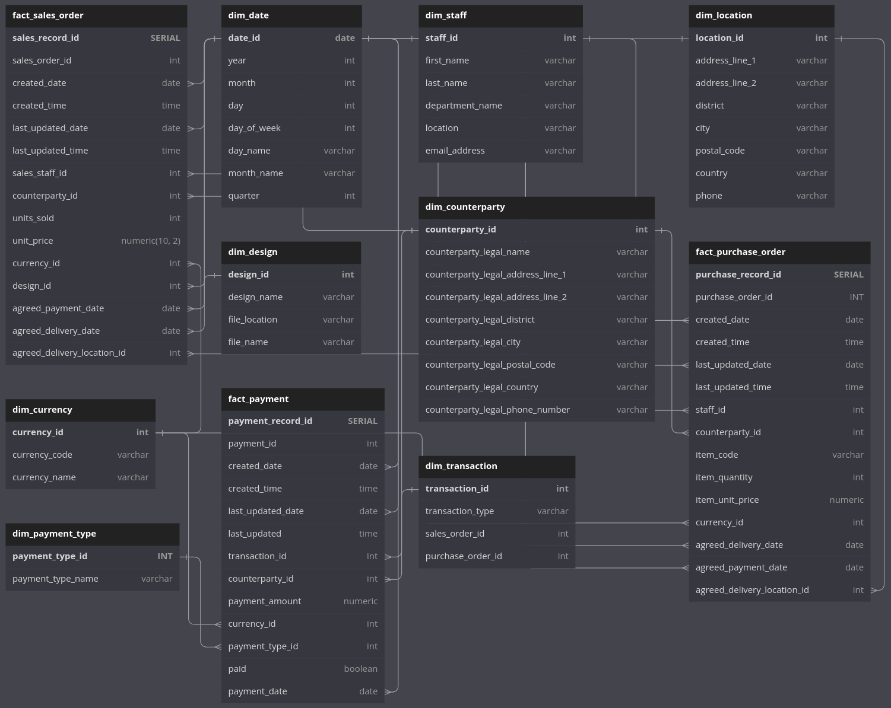

# de-terrific-totes-project


---

## Table of Contents

| Contents                                                |
| :------------------------------------------------------ |
| [Project Summary](#project-summary)                     |
| [Directions for Deployment](#directions-for-deployment) |
| [How it Works](#how-it-works)                           |

---

## Project Summary

A data platform that extracts data from an operational database, archives it in a data lake, and makes it available in a remodelled OLAP data warehouse.

---

The primary data source for the project is a database called **totesys** which is meant to simulate the back end data of a commercial application. The company **Terrific Totes** makes branded and customised tote bags for retail and corporate clients.
Fake data from the sales and purchasing teams is inserted and updated into this database several times a day.

The full ERD for the database is detailed [here](https://dbdiagram.io/d/6332fecf7b3d2034ffcaaa92).

In order to optimise data for analytical queries away from the operational systems, the data is remodelled into three overlapping star schemas:

- ["Sales" schema](https://dbdiagram.io/d/637a423fc9abfc611173f637)
- ["Purchases" schema](https://dbdiagram.io/d/637b3e8bc9abfc61117419ee)
- ["Payments" schema](https://dbdiagram.io/d/637b41a5c9abfc6111741ae8)

The overall structure of the resulting [data warehouse](https://dbdiagram.io/d/63a19c5399cb1f3b55a27eca) is shown below:



[(Back to top)](#de-terrific-totes-project)

---

## Directions for Deployment

There are two primary ways of deploying the infrastructure and functionality contained within this repo. This section will take you through each method step-by-step.

1. Using GitHub Actions:

   - Fork the repository.
   - In your version of the repo on GitHub, from it's main page, click on Settings, then Secrets And Variables, then Actions.
   - In your forked version of the repo on Github, click on Settings → Secrets And Variables → Actions.
   - From the Actions and Secrets page, click New Repository Secret.
   - Create 4 repository secrets:

     | Secret Name                |
     | :------------------------- |
     | DATABASE_CREDENTIALS       |
     | DATA_WAREHOUSE_CREDENTIALS |
     | AWS_ACCESS_KEY             |
     | AWS_SECRET_KEY             |

     - Note: as repository owner, only you can change the value of these secrets in future.

   - The data warehouse and database credentials secrets must be formatted correctly to ensure they are successfully parsed as key/value pairs by AWS Secrets Manager.

     #### Database and Data Warehouse Credentials Formatting:

     ```json
     {"host": "somewhere-on-internet", "port": "5432", "database": "dummy", "user": "dummy", "password": "your-password"}
     ```

   - Change the name of the bucket for storing the Terraform state file in **backend.tf** and **test-and-deploy.yml** files. This will ensure a unique bucket is created.
   - On your forked repo page, click on the Actions menu, then on the Final Test and Deploy workflow. Next to the notice that this repo has a workflow dispatch, click on Run Workflow, from main branch and in dev environment.
   - In future, your code will redeploy when you push code to the main branch or trigger this dispatch again. You may wish to create branch protections and remove the workflow dispatch in the YAML file to ensure that this only happens with a degree of control.

2. Local Deployment:

   - Fork the repo and clone it to your local machine.
   - Install Terraform as outlined [here](https://developer.hashicorp.com/terraform/tutorials/aws-get-started/install-cli).
   - In the root directory, set up a virtual environment with:

     ```sh
     python -m venv venv
     ```

   - Activate the environment using the following command:

     ```sh
     source venv/bin/activate
     ```

     - Note: this repo will require you to use **Python 3.9.16** as instructed in the .python-version file.

   - In the repo's root directory, run the following command in your terminal:

     ```sh
     make all
     ```

   - This instructs the Makefile to run it's **'all'** command, which will install all the dev requirements needed in the requirements.txt file. The runtime requirements are handled within the Terraform infrastructure.

   - Use `aws configure` command, then enter in your AWS login details.
   - Run `aws sts get-caller-identity` to check you are logged in correctly.
   - Apply the terraform state bucket creation command as follows (add a suffix to make sure the bucket name is unique):

     ```sh
     aws s3 mb s3://terraform-state-bucket-totedd-<SUFFIX>
     ```

   - set the name of the state bucket in the **test-and-deploy.yml** and **backend.tf** files to match the bucket you have just created.
   - Apply `terraform init -reconfigure` to initialise terraform and use the state file bucket as a backend.
   - Terraform plan and apply (see note below)
   - When using both `terraform plan` and `terraform apply` commands, terraform will prompt you to provide the sensitive values database_info and warehouse_info. Use [this](#database-and-data-warehouse-credentials-formatting) template.
   - To avoid manual input use a **secret.tfvars** file saved in the terraform folder and the command: `terraform apply -var-file="secret.tfvars"`.

     #### Format Required for AWS to Parse Secrets as Key / Value Pairs in secret.tfvars:

     ```
     database_info = "{ \"host\" : \"some-where-on-internet\", \"port\" : \"8686\", \"database\" : \"dummy\", \"user\" : \"dummy\", \"password\" : \"my-pass" }"
     ```

[(Back to top)](#de-terrific-totes-project)

---

## How it Works

1. [Python Functions and Tests](#1-python-functions-and-tests)
2. [Terraform](#2-terraform)
3. [Makefile](#3-makefile)
4. [YAML](#4-yaml)

---

### 1. Python Functions and Tests

The three Python files held in the src folder correspond to the ETL process which the pipeline builds.

### Ingestion.py

This script extracts data from a PostgreSQL database and places it into an S3 bucket for ingested data as a series of CSV files corresponding to the tables of the ingested database.

### Transformation.py

This script retrieves the ingested files, then processes and transforms the data, converting it from CSV to Parquet format, and models and rationalises the data to correspond to the schema requested by the fictional clients Terrific Totes. It puts the newly created Parquet files into our second S3 bucket for processed data, now corresponding to each table in the remodelled schema.

### Population.py

This script loads the Parquet files from the processed data bucket and places them into the data warehouse as requested by Terrific Totes.

The Python scripts are each zipped alongside their runtime dependencies into a single file, which is used by AWS Lambda to run the processes with appropriate triggers. Pandas is too large to zip without creating a Lambda Layer (which our Whizlabs AWS instances lacked the permissions to create), so we used the pre-built Pandas layer which AWS provide.

Each file is thoroughly tested using mocking and patching, and our testing coverage currently stands at 96%.

---

### 2. Terraform

The Terraform folder contains a collection of files and directories that are organized in a way that makes the code readable and easy to understand. Each directory and file serves a specific purpose, which we'll explore in more detail below.

#### **.terraform directory**

- The .terraform directory typically holds the state file, which is used to keep track of the current state of the infrastructure.
- However, in this project the state file is hosted in an S3 bucket
  on AWS for shared access.

#### **lambda-dependencies directory**

- The lambda-dependencies directory contains the necessary dependencies for each of the three Lambda functions:
  - Ingestion
  - Processing
  - Population
- These dependencies are then zipped and stored in their respective
  folders in the zips directory.

#### **zips directory**

- The zips directory contains three sub-directories, each of which contains the zipped versions of the **dependencies.txt** files for the respective Lambda functions.

#### **.terraform.lock.hcl**

- Terraform can deal with external dependencies that come from outside of its own codebase which can be published and updated independently from Terraform.
- For that reason, Terraform must determine which versions of those dependencies are potentially compatible with the current configuration.
- Terraform remembers the decisions it made in a dependency lock file so that it can (by default) make the same decisions again in future.
- Terraform automatically creates or updates the dependency lock file each time the `terraform init` command is run.

#### **alarm.tf**

- The **alarm.tf** file contains the necessary elements of AWS alarms including:
  - Cloudwatch log metric filters
  - Cloudwatch metric alarms
  - SNS topics and subscriptions
  - Lambda permissions
- Two Lambda permissions were set up to allow SNS to trigger both the processing and population Lambdas.
- The completion of the previous Lambda function raises an alarm status, which then uses the SNS triggers to initiate the appropriate Lambda function.
- Additional alarms are set up for each Lambda function in case of an error. These alarms send an email to the project email address: terrifictotedd@gmail.com

#### **backend.tf**

- The backend contains the bucket in which the terraform statefile is stored and states the required version of terraform which is **1.3.7** or later.

```
required_version  =  "~> 1.3.7"
```

#### **cloudwatch-iam.tf**

- The **cloudwatch-iam.tf** file contains the neccessary AWS IAM policies, policy documents and policy attachments for Cloudwatch.

#### **data.tf**

- The **data.tf** file copies the text file dependencies from the lambda-dependencies directory into their respective zips directory. Then these text files are zipped and the dependencies are installed to the Lambda functions.

#### **iam.tf**

- The **iam.tf** file contains the neccessary AWS IAM policies, policy documents, policy attachments for the Lambda functions. These include read/write access to the necessary buckets.

#### **lambda.tf**

- Contains the three lambda functions as well as the Cloudwatch/EventBridge rules and permissions for the ingestion Lambda.

#### **s3.tf**

- Contains the two AWS S3 buckets for ingested data and processed data.

#### **secrets.tf**

- Utilises AWS Secrets Manager to store the database and warehouse credentials.

#### **vars.tf**

- A file containing variables for other Terraform files.

---

### 3. Makefile

- A script file used to run validation checks on Python code in the repository.
- The Makefile can be run manually by running `make all` in the CLI.
- The file contains commands to:
  - Create the virtual environment.
  - Install package requirements using **requirements.txt**.
  - Install security, coverage and formatting packages (Bandit, Safety, Coverage, Flake8).
  - Run unit-tests using **Pytest** and all validation packages.

---

### 4. YAML

YAML files are used to enable agile practices such as continuous integration and deployment via [Github actions](https://docs.github.com/en/actions).

This repository contains two YAML files to build our CI/CD pipeline:

1. **test-and-compliance.yaml**
2. **test-and-deploy.yaml**

#### Test and Compliance

- Runs on a pull request to the main branch or can be triggered manually on Github's Actions page.
- Two processes are run asynchronously:
  - Running Makefile commands for validation:
    - unit-tests
    - compliance checks for security, Flake8 formatting, and coverage
  - Running Terraform Validate for **.tf** file syntax checks.

#### Test and Deploy

- Runs on a push to the main branch or can be triggered manually on Github's Actions page (Can only be run from the **main** branch).
- First runs the same testing code from Makefile for a final validation check.
- Once all the validation tests pass it runs the processes required to seamlessly deploy the code infrastructure:
  - Connects to AWS using credentials from the Github repository Secrets page.
  - Creates a Terraform **.tfstate** file on S3.
  - Initialises Terraform and runs `terraform apply` using the database and warehouse credentials from the Github repository Secrets page.

[(Back to top)](#de-terrific-totes-project)

---
